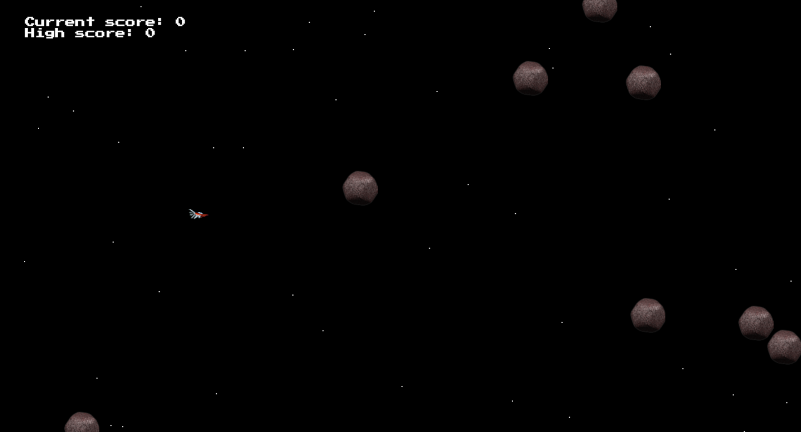

## AsteroidBlast

[Live Site][site]

[site]: http://michaelduke.nyc/AsteroidBlast/

AsteroidBlast is a browser-based game built with Javascript and HTML5, inspired by classic side-scrolling shooter games.

## Features
- Renders side-scrolling game view using multiple HTML5 Canvas layers.
- Game automatically resizes to player's window
- Implements collision detection based on trigonometric functions.
- Game difficulty progresses based on player's current score

## The Star Background

The side-scrolling background was created using a separate canvas element with a z-index less than that of the main game canvas. The 3D effect is a result of the many rendered stars having different speeds and vertical positions, producing an illusion that there is depth to the background and that the ship is traveling to the right.
